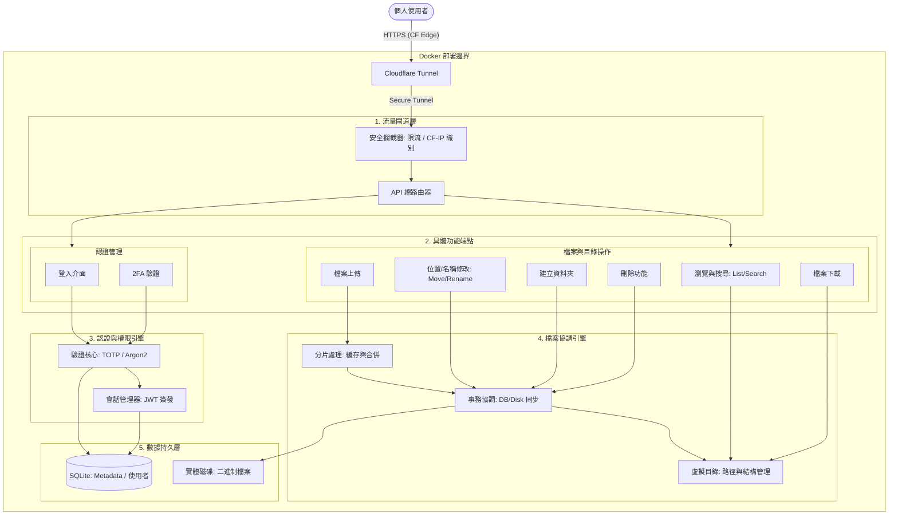

# File Explorer

一個用來做檔案上傳的個人網站，方便自己遠端操作

## 系統架構




## 目前進度

### Phase 1: 基礎建設與安全驗證 [已完成 100%]

- [x] **專案骨架與容器化**: 建立 FastAPI 目錄結構、`.env` 管理與 `docker-compose.yml`，cloudflare 留到後期。
- [x] **資料庫基礎與 WAL 配置**: 實作 SQLAlchemy 異步連線，並強制開啟 SQLite **WAL 模式**，定義 `User` 模型。
- [x] **密碼哈希 (Argon2 Hasher)**: 整合 `passlib[argon2]`，實作密碼雜湊與驗證，建立首位 Admin 腳本。
- [x]  **雙重驗證鎖 (TOTP Logic)**: 使用 `pyotp` 實作 2FA 密鑰生成與 6 位數驗證碼。
- [x] **通行證與 IP 紀錄 (JWT & Middleware)**:  實作 JWT 簽發、**CF-Connecting-IP** 識別中介層與基礎限流防護。
- [x] **門禁櫃台 API (Auth Endpoints)**: 串連上述邏輯，完成 `/login`、`/verify-2fa` 與 `/me` 測試端點。

---

### Phase 2: VFS 結構與瀏覽邏輯 (檔案結構)
*   **對應模組**：EP_Browse -> VFS -> DB (File Metadata)
*   **實作重點**：
    *   定義檔案元數據 (Metadata) 模型。
    *   實作虛擬目錄解析邏輯 (將 DB 記錄映射至邏輯目錄樹)。
    *   完成「讀取列表」與「搜尋檔案」功能。

### Phase 3: 事務協調與實體同步 (變更管理)
*   **對應模組**：EP_Modify/Mkdir/Delete -> Tx_Coord -> VFS/Disk
*   **實作重點**：
    *   實作 **Tx_Coord (事務協調器)**，處理磁碟 `os.rename/mkdir` 與資料庫記錄的同步原子性。
    *   完成「建立資料夾」、「移動位置」與「重命名」功能。
    *   完成「檔案刪除」功能（包含實體與記錄的同步清理）。

### Phase 4: 數據傳輸管道 (檔案 IO)
*   **對應模組**：EP_Upload/Download -> Chunk_Mgr -> Tx_Coord -> Disk
*   **實作重點**：
    *   實作 **Chunk_Mgr (分片處理器)** 處理大檔案上傳、暫存與合併。
    *   實作檔案串流讀取 (Download) 與寫入 (Upload) 的 IO 優化。

### Phase 5: 輔助系統與處理 (功能增強)
*   **對應模組**：Media_Aux
*   **實作重點**：
    *   實作非同步媒體處理器 (Media Processor)，生成縮圖與提取元數據。

## 技術棧
- **Backend**: FastAPI (Python)
- **Frontend**: Vue 3 + Vite + Tailwind CSS
- **Database**: SQLAlchemy 2.0 (Async) + SQLite
- **Security**: Argon2 (Password), PyOTP (2FA), Jose (JWT)
- **Container**: Docker + Docker Compose

## 快速啟動 (開發環境)
```powershell
docker-compose up --build -d
```
服務啟動後可訪問：
- **API 文件**: `http://localhost:8000/docs`
- **前端介面**: `http://localhost:5173` (開發中)