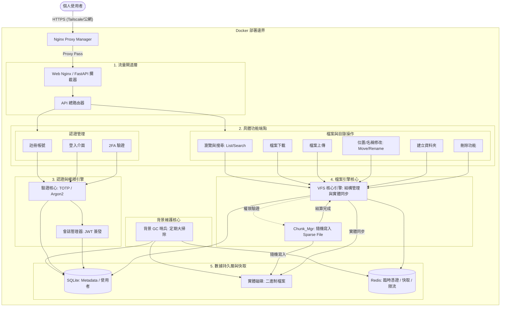
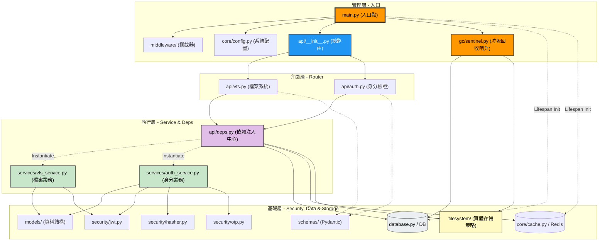

# File Explorer

這個專案主要是給我個人學習與使用的，類似一個 NAS 系統架設在小電腦上，但是我希望把它做成支援多人的檔案系統

## 前端展示

<video width="100%" controls>
  <source src="./docs/salty-file-explore-demo.mp4" type="video/mp4">
</video>

## 使用到的技術

* 後端 (Python)
    * FastAPI (非同步核心框架)
    * SQLAlchemy (非同步 ORM)
    * SQLite (開啟 WAL 模式的高效本地資料庫)
    * Redis (快取、限流與單次下載憑證鎖)
    * PyOTP & JWT (雙重驗證 2FA 與身分授權)
* 前端 (TypeScript)
    * Vue 3 (Composition API)
    * Vite (極速建置工具)
    * Pinia (狀態管理)
    * Tailwind CSS (玻璃擬物化 Glassmorphism 設計)
    * Axios (支援攔截器與上傳進度追蹤)
* Infra (基礎設施)
    * Docker & Docker Compose (容器化微服務部署)
    * Tailscale (Zero-Trust P2P 虛擬區域網路)
    * Nginx Proxy Manager (反向代理與 Let's Encrypt 自動憑證)
    * Cloudflare (DNS 解析管理)

## 系統核心特色 (Key Features)

### 📂 虛擬檔案系統 (Virtual File System, VFS)
* **資料庫驅動 (Metadata)**：檔案改名與搬移皆為純資料庫操作，零磁碟 I/O 延遲。
* **併發分塊與隨機寫入**：大檔案前端切塊併發上傳，後端預分配 Sparse File 空間並透過 `seek(offset)` 隨機寫入，徹底消滅大檔案合併瓶頸。
* **跨資料夾斷點續傳**：無縫暫停與恢復傳輸，即使切換不同資料夾也能記住進度並正確歸檔。
* **軟刪除與背景清理 (GC)**：檔案刪除先進入隱藏狀態，由背景哨兵 (Sentinel) 定時非同步清理實體磁碟。

### 🛡️ 資安與身分驗證 (Security & Auth)
* **JWT 授權 & Argon2 加密**：採用高強度密碼學防護與無狀態授權。
* **雙重驗證 (2FA/TOTP)**：支援 Authenticator App 掃碼綁定，防止帳號盜用。
* **單次下載憑證 (Ticket)**：透過 Redis 派發 30 秒拋棄式下載憑證，防禦重放攻擊與伺服器過載。

## 業務功能架構圖 (Functional Architecture)

本圖表呈現了外部請求從進入系統到觸發底層實體寫入的「功能端點與業務流向」。

---

## 系統程式結構圖 (System Module Structure)

本圖表呈現以後端 `app.main` 為核心的「程式碼調用階層與模組依賴關係」。

### 核心層級說明

1.  **管理層 (Top)**：`main.py` 負責將所有模組組裝起來。在應用啟動時，它會拉起背景垃圾回收哨兵 (`app/gc/sentinel.py`) 任務並初始化資料庫與 Redis 連線池 (`lifespan`)；並在應用關閉時，優雅地釋放連線與取消哨兵，避免資源洩漏。
2.  **路由層 (Router)**：`api/` 負責分流外部 HTTP 請求，但不處理複雜邏輯。
3.  **依賴層 (Deps)**：`deps.py` 像是一個橋樑，把底層的「資料庫」、「Redis 快取」與「安全工具」提供給上層。
4.  **執行層 (Logic)**：`services/` 才是真正動手處理資料的地方。
5.  **基礎層 (Base)**：`models`, `database`, `cache.py`, `security` 是最純粹的工具，不依賴任何人。
