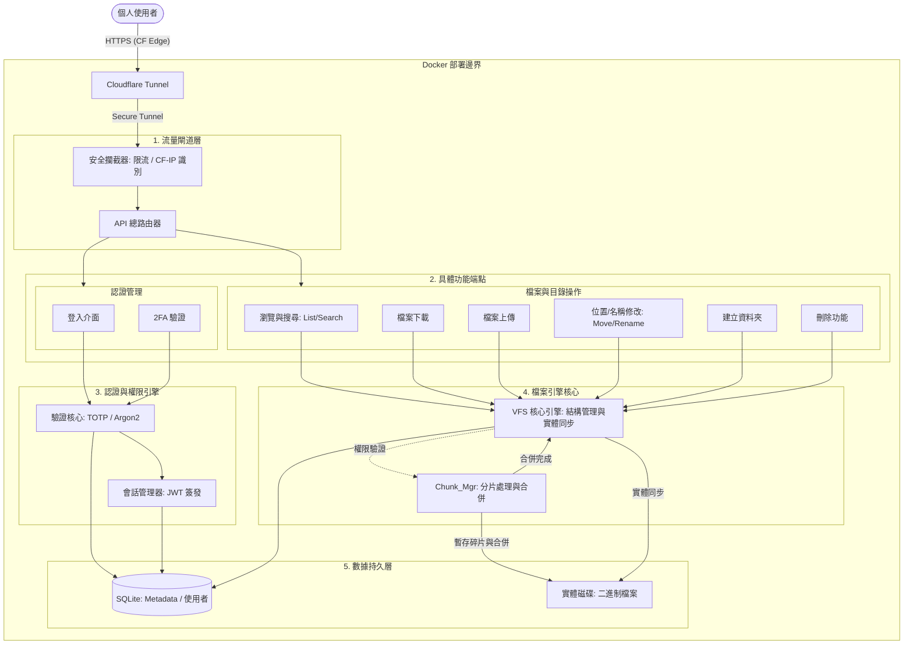

# File Explorer

一個用來做檔案上傳的個人網站，方便自己遠端操作

但實作的方式，我希望更貼近大專案的想法與做法

## 系統架構




## 目前進度

### Phase 1: 基礎建設與安全驗證 [已完成 100%]

- [x] **專案骨架與容器化**: 建立 FastAPI 目錄結構、`.env` 管理與 `docker-compose.yml`，cloudflare 留到後期。
- [x] **資料庫基礎與 WAL 配置**: 實作 SQLAlchemy 異步連線，並強制開啟 SQLite **WAL 模式**，定義 `User` 模型。
- [x] **密碼哈希 (Argon2 Hasher)**: 整合 `passlib[argon2]`，實作密碼雜湊與驗證，建立首位 Admin 腳本。
- [x]  **雙重驗證鎖 (TOTP Logic)**: 使用 `pyotp` 實作 2FA 密鑰生成與 6 位數驗證碼。
- [x] **通行證與 IP 紀錄 (JWT & Middleware)**:  實作 JWT 簽發、**CF-Connecting-IP** 識別中介層與基礎限流防護。
- [x] **門禁櫃台 API (Auth Endpoints)**: 串連上述邏輯，完成 `/login`、`/verify-2fa` 與 `/me` 測試端點。

---

### Phase 2: VFS 結構與瀏覽邏輯 (Metadata & Navigation) [已完成 100%]
- [x] **Step 2.1: 元數據建模 (Metadata Schema)**: 建立 `Folder` 與 `File` 模型，包含 UUID, `hash_sha256` 與複合索引優化。
- [x] **Step 2.2: 導航核心 (Navigation Core)**: 實作「UUID 查詢」邏輯與「麵包屑 (Breadcrumbs) 產生器」。
- [x] **Step 2.3: 瀏覽端點 (Browse API)**: 實作 `/browse/ls/{folder_id}` 與 `/browse/search` 端點，支援分頁與排序。
- [x] **Step 2.4: 系統初始化與安全 (Initial Root & Security)**: 實作啟動時自動建立使用者根目錄，並確保 UUID 存取安全性。

### Phase 3: VFS 節點邏輯管理 (Purely Virtual Mutation)
> [!NOTE]
> **本階段目標**：專注於純邏輯的「目錄樹節點」維護。在此架構下，目錄僅為資料庫中的虛擬節點，不與磁碟實體資料夾掛鉤。

- [x] **Step 3.0: 基礎優化與安全強化**: 統一 Service 層參數風格，實作 2FA Token 階段鎖定與 User Schema。
- [x] **Step 3.1: 虛擬節點建立 (Mkdir)**: 實作資料庫目錄節點建立，確保父子權限正確。
- [x] **Step 3.2: 節點更名與搬移 (Rename/Move)**: 實作 DB 層級的父子關係變更與命名衝突檢查（秒級移動）。
- [x] **Step 3.3: 邏輯刪除與回收站 (Soft Delete)**: 實現 VFS 節點的 `is_deleted` 狀態管理。

### Phase 4: 實體傳輸與檔案管理 (Physical Storage & File VFS)
> [!IMPORTANT]
> **設計準則：實體優先 (Physical-First)**
> 檔案在 VFS 中的「入籍」必須發生在實體儲存成功之後，確保 DB 紀錄與磁碟狀態絕對一致。

- [ ] **Step 4.1: 儲存抽象層 (Storage Provider)**: 實作底層硬碟讀寫引擎，處理 UUID 檔名與實體路徑映射。
- [ ] **Step 4.2: 檔案入籍與變更 (File VFS Mutation)**: 實作「檔案」的建立、重新命名、搬移與邏輯刪除邏輯。
- [ ] **Step 4.3: 分片傳輸管道 (Chunked Upload)**: 實作分片接收、雜湊校驗與背景合併機制。
- [ ] **Step 4.4: 串流下載與清理 (IO & Cleanup)**: 實作高性能下載管道，以及根據 `is_deleted` 狀態執行的實體清理。

### Phase 5: 輔助系統與處理 (功能增強)
- [ ] **Media Processor**: 實作非同步媒體處理器，生成縮圖與提取元數據。

### Phase 6: 系統完善與管理 (Admin & Polish)
- [ ] **Step 6.1: 自助安全管理**: 實作使用者 2FA 綁定流程與密碼修改功能。
- [ ] **待定**: 根據實測反饋決定後續系統優化項目。

## 技術棧
- **Backend**: FastAPI (Python)
- **Frontend**: Vue 3 + Vite + Tailwind CSS
- **Database**: SQLAlchemy 2.0 (Async) + SQLite
- **Security**: OAuth2 (Bearer Token), Argon2 (Password), PyOTP (2FA), Jose (JWT)
- **Container**: Docker + Docker Compose

## 快速啟動 (開發環境)
```powershell
docker-compose up --build -d
```
服務啟動後可訪問：
- **API 文件**: `http://localhost:8000/docs`
- **前端介面**: `http://localhost:5173` (開發中)

---

## 架構設計思考 (Architectural Thinking)

### 1. 異常處理的層級分工 (Exception Handling)
**問題**：`HTTPException` 應該在 Service Layer 還是 API Layer 處理？
**原則**：**「低層拋出訊息，高層決定行為」**。
- **Service Layer (底層/廚師)**：負責偵測「業務邏輯錯誤」（如：找不到節點、命名衝突）。它應該拋出 **純粹的邏輯異常** (如 `NodeNotFoundError`)，而不是 HTTP 異常。
- **API Layer (高層/服務生)**：負責將邏輯異常 **「翻譯」** 成適合當前通訊協定的格式（如 `HTTP 404`）。
- **優點**：確保 Service Layer 的通用性，使其能被 CLI、腳本或背景任務複用，而不依賴於特定的 Web 框架 (FastAPI)。

### 2. Fail-Fast 原則
- **偵測 (Detection)**：錯誤偵測應離「成因」與「實作地點」越近越好，以便於快速定位問題。
- **處理 (Handling)**：錯誤處置應拉遠到高層決定，以保持系統整體的彈性與策略一致性。
