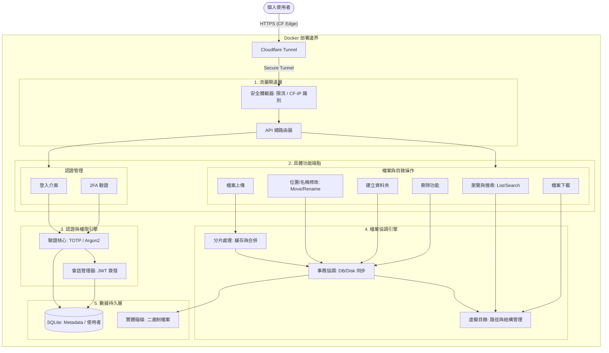

# 個人檔案分享系統 - 系統化架構說明書

本文件詳述了系統的邏輯功能解耦設計，強調「功能模組化」與「事務完整性」，確保個人檔案存取的高度安全與穩定。

---

## 1. 邏輯功能架構圖 (Pipeline Architecture)

此圖表展示了從使用者請求進入，到具體功能分發，最後執行底層邏輯與持久化的完整管道。

---

## 2. 實作順序規劃 (Implementation Roadmap)

根據上述 Pipeline 架構，系統將分為五個階段進行開發，確保每一層的依賴關係正確且風險受控：

### Phase 1: 基礎設施與 IAM 安全核心 (容器化與身分驗證)
*   **對應模組**：CF_Tunnel -> Ingress -> Auth_Endpoints -> IAM_Core -> DB (User)
*   **詳細實作步驟**：
    *   **Step 1.1: 專案骨架與容器化 (Project Scaffold)**
        *   建立 FastAPI 目錄結構、`.env` 管理與 `docker-compose.yml` (含 cloudflared 佔位)。
    *   **Step 1.2: 資料庫基礎與 WAL 配置 (Database Foundation)**
        *   實作 SQLAlchemy 異步連線，並強制開啟 SQLite **WAL 模式**，定義 `User` 模型。
    *   **Step 1.3: 密碼碎紙機 (Argon2 Hasher)**
        *   整合 `passlib[argon2]`，實作密碼雜湊與驗證，建立首位 Admin 腳本。
    *   **Step 1.4: 雙重驗證鎖 (TOTP Logic)**
        *   使用 `pyotp` 實作 2FA 密鑰生成與 6 位數驗證邏輯。
    *   **Step 1.5: 通行證與警衛 (JWT & Middleware)**
        *   實作 JWT 簽發、**CF-Connecting-IP** 識別中介層與基礎限流防護。
    *   **Step 1.6: 門禁櫃台 API (Auth Endpoints)**
        *   串連上述邏輯，完成 `/login`、`/verify-2fa` 與 `/me` 測試端點。

### Phase 2: VFS 結構與瀏覽邏輯 (檔案結構)
*   **對應模組**：EP_Browse -> VFS -> DB (File Metadata)
*   **實作重點**：
    *   定義檔案元數據 (Metadata) 模型。
    *   實作虛擬目錄解析邏輯 (將 DB 記錄映射至邏輯目錄樹)。
    *   完成「讀取列表」與「搜尋檔案」功能。

### Phase 3: 事務協調與實體同步 (變更管理)
*   **對應模組**：EP_Modify/Mkdir/Delete -> Tx_Coord -> VFS/Disk
*   **實作重點**：
    *   實作 **Tx_Coord (事務協調器)**，處理磁碟 `os.rename/mkdir` 與資料庫記錄的同步原子性。
    *   完成「建立資料夾」、「移動位置」與「重命名」功能。
    *   完成「檔案刪除」功能（包含實體與記錄的同步清理）。

### Phase 4: 數據傳輸管道 (檔案 IO)
*   **對應模組**：EP_Upload/Download -> Chunk_Mgr -> Tx_Coord -> Disk
*   **實作重點**：
    *   實作 **Chunk_Mgr (分片處理器)** 處理大檔案上傳、暫存與合併。
    *   實作檔案串流讀取 (Download) 與寫入 (Upload) 的 IO 優化。

### Phase 5: 輔助系統與處理 (功能增強)
*   **對應模組**：Media_Aux
*   **實作重點**：
    *   實作非同步媒體處理器 (Media Processor)，生成縮圖與提取元數據。

---

## 3. 實作注意事項 (Critical Implementation Notes)

在實作各階段模組時，必須嚴格遵守以下準則，以確保系統的健壯性：

### 1. SQLite 併發效能優化 (Phase 1 & 3)
*   **問題**：分片上傳與大量檔案操作可能導致 `Database is locked`。
*   **準則**：初始化資料庫連線時，必須開啟 **WAL (Write-Ahead Logging)** 模式。這能讓讀寫操作在很大程度上互不阻塞，大幅提升併發能力。

### 2. 跨系統事務一致性 (Phase 3)
*   **問題**：Disk 與 DB 是獨立系統，難以實現硬性原子性。
*   **準則 (雙寫邏輯)**：
    *   **建立/上傳**：採「磁碟優先」。
        1. 寫入實體磁碟。
        2. 成功後更新 DB Metadata。
        3. 若 DB 失敗，立即執行磁碟回滾（刪除已寫檔案）。
    *   **刪除/移動**：採「標記優先」。
        1. 在 DB 中將記錄標記為 `pending_action` 或軟刪除。
        2. 執行磁碟實體操作（`os.remove`/`os.rename`）。
        3. 成功後，再徹底完成 DB 狀態更新或清除記錄。

### 3. 資源清理與回收 (Phase 4)
*   **問題**：中斷的上傳會產生「孤兒分片 (Orphan Chunks)」佔據空間。
*   **準則**：`Chunk_Mgr` 必須具備垃圾回收機制。需實作背景排程或定期檢查，自動刪除超過 24 小時未完成合併的過時分片目錄。
