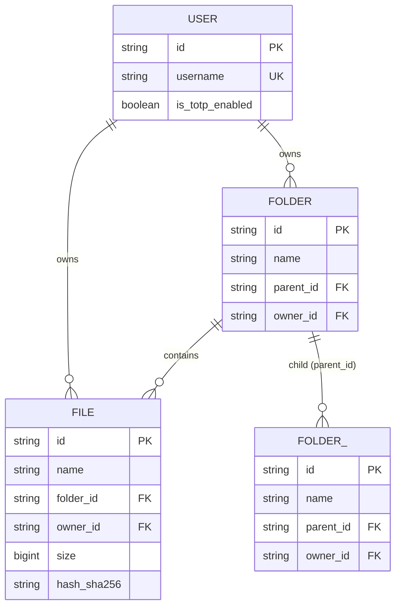

# Database Schema (ER Diagram)

本文件描述 File Explorer 系統的資料庫實體關係圖 (Entity Relationship Diagram)。

## 術語說明 (Glossary)

*   **PK (Primary Key) - 主鍵**: 資料表的唯一識別碼，每一筆紀錄都必須有一個不重複的 PK。
*   **FK (Foreign Key) - 外鍵**: 用於連結兩張表的欄位，指向另一張表的 PK，確保資料的關聯完整性。
*   **UK (Unique Key) - 唯一鍵**: 該欄位的值在整張表中不能重複（例如：使用者名稱）。

## 關係說明

1.  **使用者與資源 (1:N)**: 
    - 一個 `USER` 可以擁有多個 `FOLDER` 與 `FILE`。
    - 資源透過 `owner_id` 嚴格綁定擁有者，確保多用戶隔離。

2.  **目錄層級 (Recursive)**:
    - `FOLDER` 透過 `parent_id` 關聯至自身的 `id`。
    - 若 `parent_id` 為空，代表該目錄為使用者的虛擬根目錄 (Root)。

3.  **目錄與檔案 (1:N)**:
    - 一個 `FOLDER` 包含多個 `FILE`。
    - 檔案透過 `folder_id` 歸屬於特定的虛擬路徑節點。

## 開發筆記 (Implementation Notes) 

紀錄我認為難懂的概念

### ForeignKey

`ForeignKey` 設定外鍵有誰

舉例 `File`

`folder_id = Column(String, ForeignKey("folders.id"), nullable=True)` 這個說明 `folder_id` 是個外鍵，連通 `folders.id`

設定 `folder_id` 會強制規定要屬於某個 `folders.id`

---

使用 `back_populates` 要互對，我不用 `back_ref`

* `File` 模組
    * `folder = relationship("Folder", back_populates="files", foreign_keys=[folder_id])`
        * 白話 `File.folder` 透過 `File.folder_id` 關聯上 `Folder.files`
    * `folder_id = Column(String, ForeignKey("folders.id"), nullable=True)`
        * File 要透過
    
* `Folder` 模組的外鍵
    * `files = relationship("File", back_populates="folder", foreign_keys="[File.folder_id]")`
        * 白話: `Folder.files` 透過 `File.folder_id` 關聯上 `File.folder` 

`relationship` `back_populates` 要求兩邊都要有

`file:folder` 是 `1:多` 的關係，所以需要 `file` 有外鍵連上 `folder`

`folder` 不會也不能存一大堆 `file_id`

---

我的情境不特別寫 `foreign_keys` 時，SQLAlchemy 推的出來，因為只有唯一的 `ForeignKey` 

但讓機器猜感覺不太好，之後新增其他同樣的 `ForeignKey` 就會出問題

### remote_side (用在自己對自己)

`parent = relationship("Folder", back_populates="subfolders", foreign_keys=[parent_id],remote_side=[id])`

這裡 `remote_side` 是必要的，因為 SQLAlchemy 認為會有歧異

不加會導致 `X.parent` 不知道該跑
* `where X.parent_id = folders.id`
* `where X.id = folders.parent_id`

---

可能會想說 `parent = relationship("Folder", back_populates="subfolders", foreign_keys=[parent_id],remote_side=[id])`

* 這個語法到底可以怎樣歧異? 不就定死 `where X.parent_id = folders.id` 就好嗎?
* `X.parent` 而 `parent_id = Column(..., ForeignKey("folders.id"), ...)`
    * 這根本很明顯是 `X.parent_id = folders.id`

那考慮看看: `subfolders = relationship("Folder", back_populates="parent", foreign_keys=[parent_id])`

呼叫 `X.subfolders` 的時候要會想要跑 `X.id = folders.parent_id`

---

因此發現下面兩者根本同樣結構，但需要不同的查詢方向

* `subfolders = relationship("Folder", back_populates="parent", foreign_keys=[parent_id])`
* `parent = relationship("Folder", back_populates="subfolders", foreign_keys=[parent_id])`

SQL 本身是支援這件事情的，SQLAlchemy 也要處理這個功能，因此強制你要規定好 `remote_side` 

`subfolders` 可以透過 `back_populates="parent"` 推出相反的邏輯，因此不設定 `remote_side`