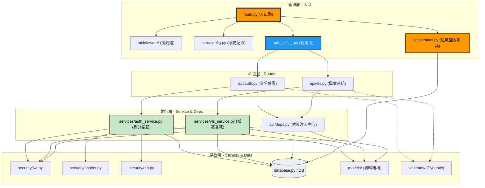

# 系統程式架構圖 (System Structure Diagram)

本圖表呈現以 `app.main` 為核心的調用階層與模組關係。

---

## 核心層級說明

1.  **管理層 (Top)**：`main.py` 負責將所有模組組裝起來。在應用啟動時，它會拉起背景垃圾回收哨兵 (`app/gc/sentinel.py`) 任務；並在應用關閉時，優雅地取消該哨兵，避免資源洩漏。
2.  **路由層 (Router)**：`api/` 負責分流外部 HTTP 請求，但不處理複雜邏輯。
3.  **依賴層 (Deps)**：`deps.py` 像是一個橋樑，把底層的「資料庫」與「安全工具」提供給上層。
4.  **執行層 (Logic)**：`services/` 才是真正動手處理資料的地方。
5.  **基礎層 (Base)**：`models`, `database`, `security` 是最純粹的工具，不依賴任何人。
